# Диаграммы системы

Визуальное представление архитектуры и процессов системы.

## Общая архитектура

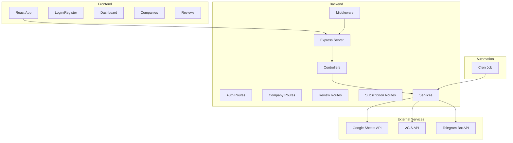

## Поток регистрации пользователя

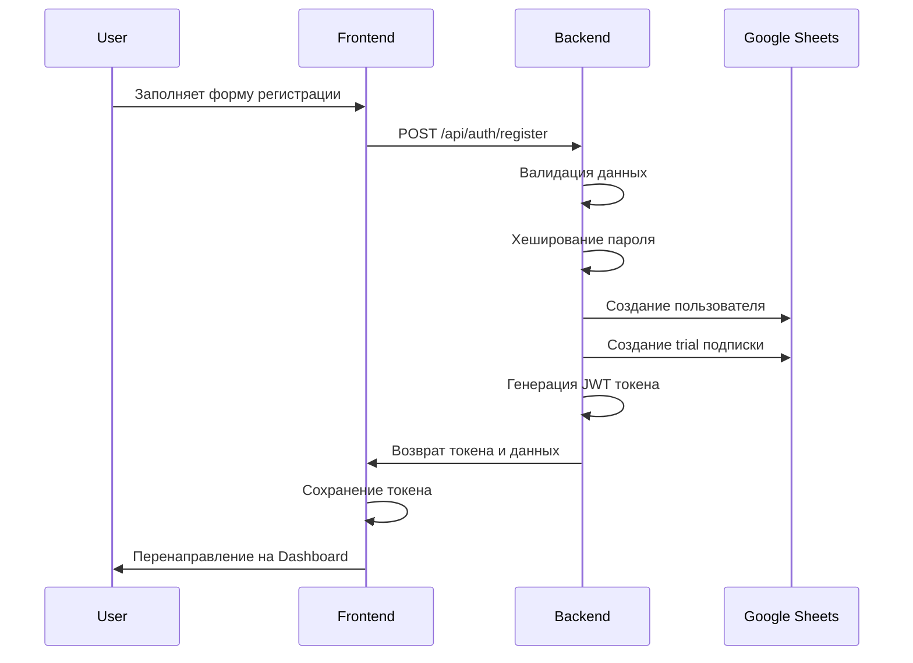

## Поток добавления компании

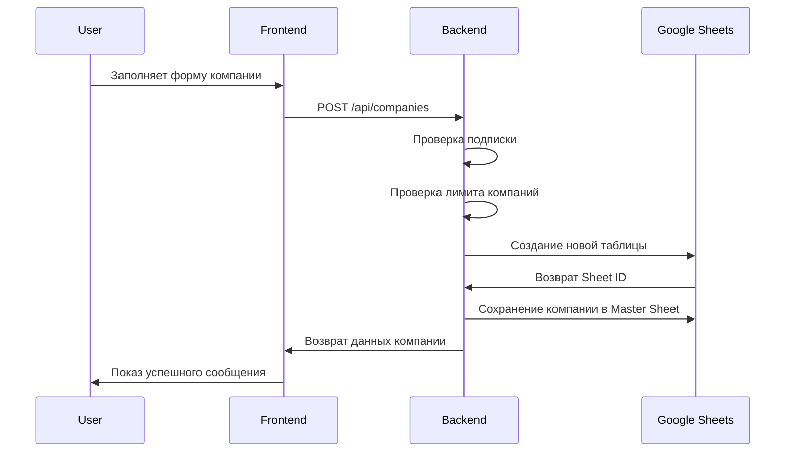

## Процесс проверки отзывов

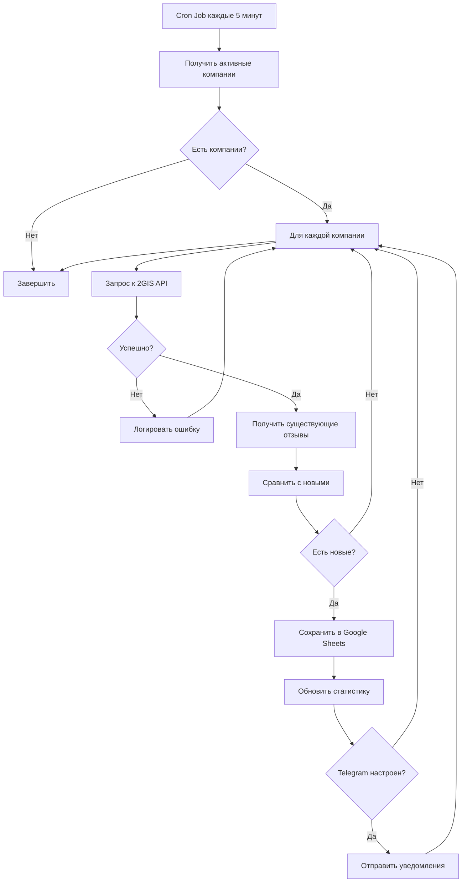

## Структура данных в Google Sheets

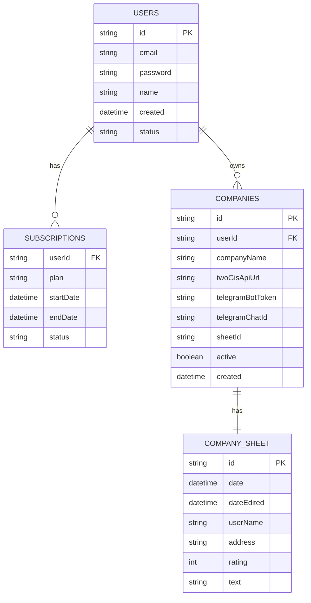

## API Endpoints

```mermaid
graph LR
    A[API /api] --> B[/auth]
    A --> C[/companies]
    A --> D[/reviews]
    A --> E[/subscriptions]

    B --> B1[POST /register]
    B --> B2[POST /login]
    B --> B3[GET /me]
    B --> B4[PUT /profile]

    C --> C1[GET /]
    C --> C2[GET /:id]
    C --> C3[POST /]
    C --> C4[PUT /:id]
    C --> C5[DELETE /:id]
    C --> C6[POST /:id/test]

    D --> D1[GET /:companyId]
    D --> D2[GET /:companyId/stats]
    D --> D3[POST /:companyId/refresh]

    E --> E1[GET /my]
    E --> E2[POST /activate]
    E --> E3[POST /cancel]
```

## Жизненный цикл отзыва

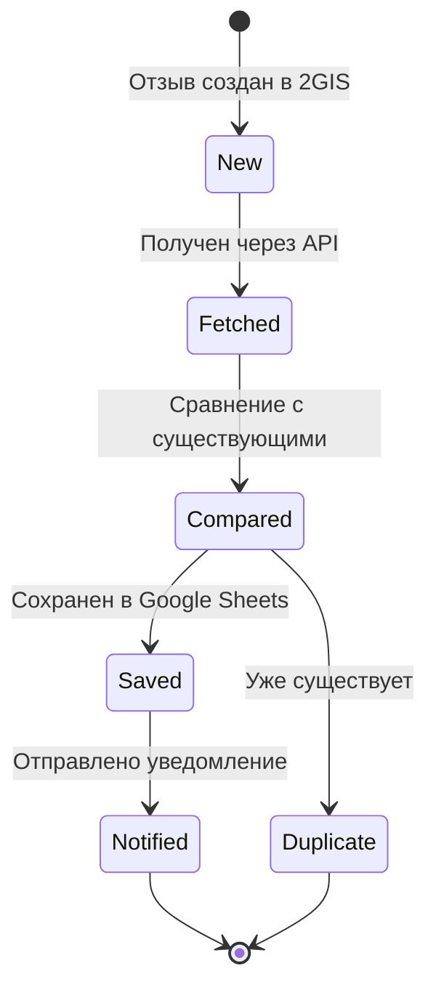

## Система аутентификации

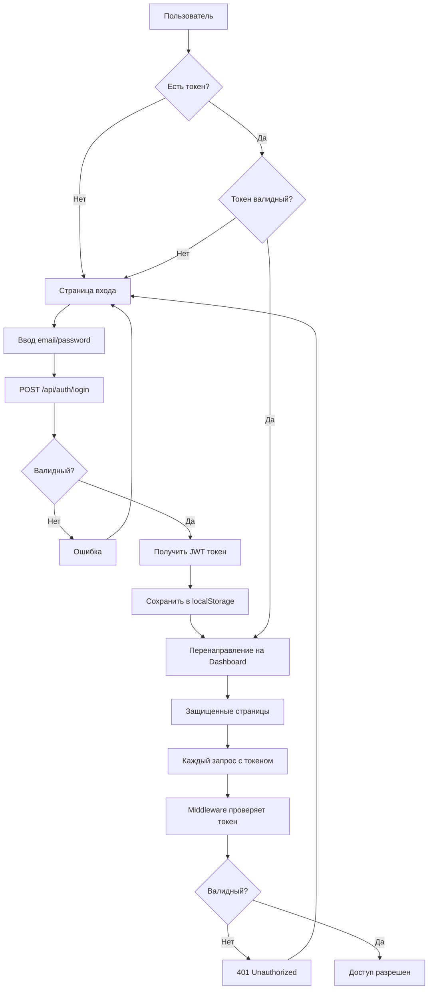

## Процесс обновления статистики

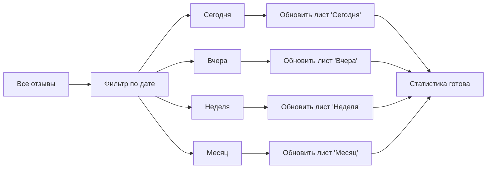

## Интеграция с Telegram

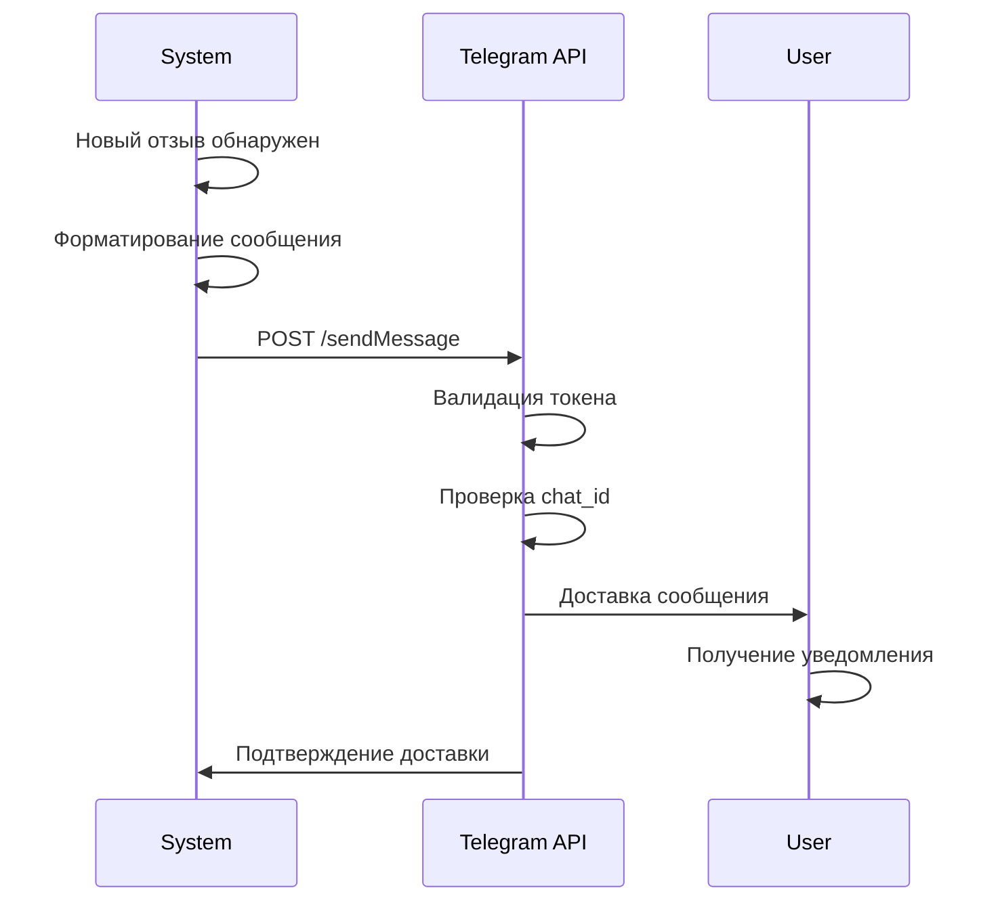

## Компоненты Frontend

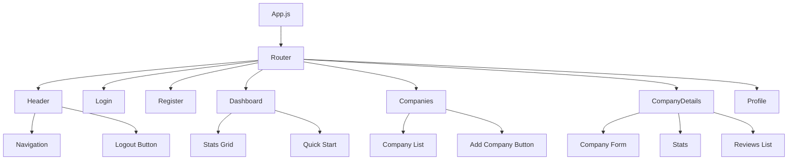

## Процесс деплоя

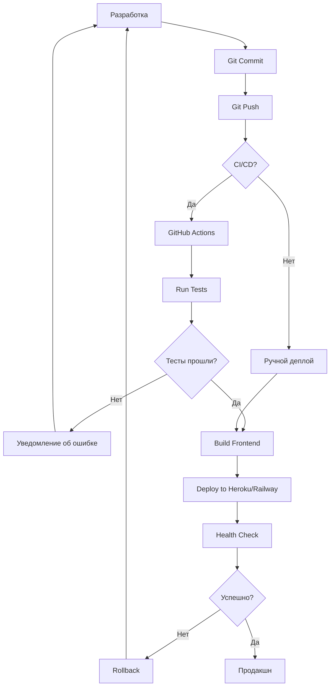

## Масштабирование системы

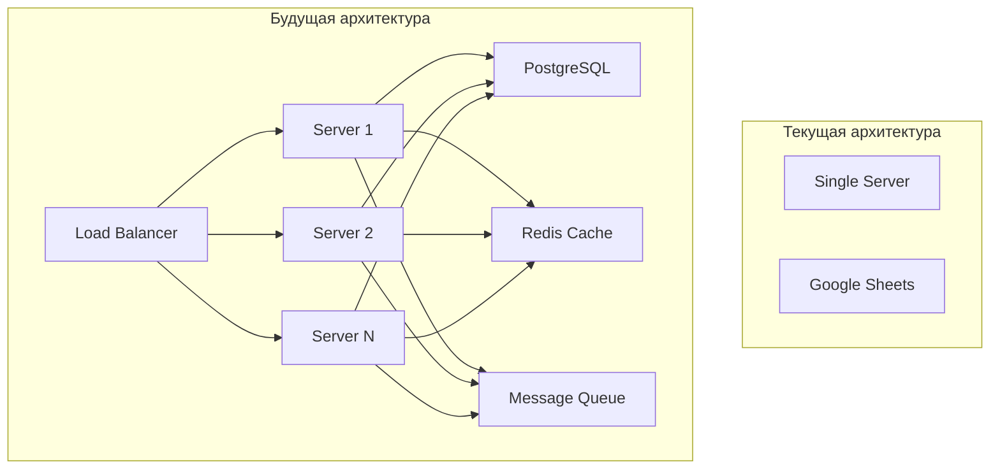

## Мониторинг и логирование

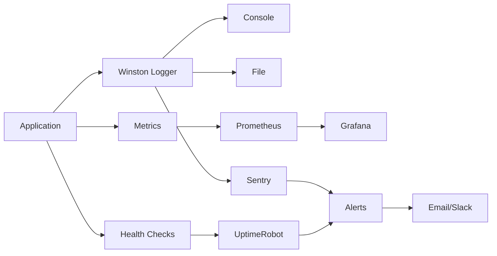

## Безопасность

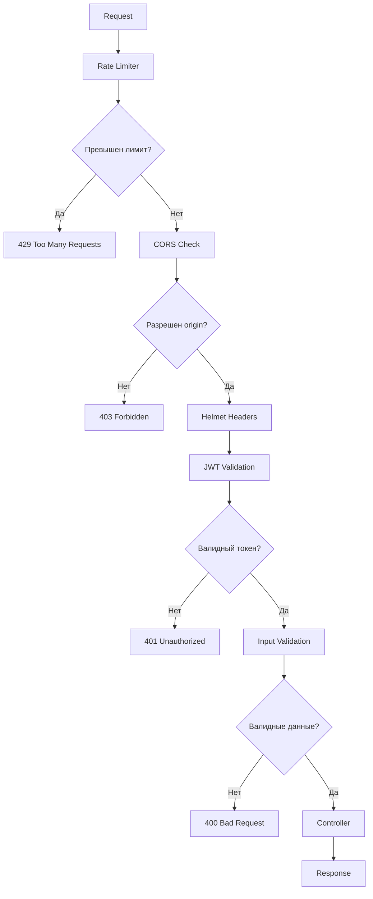

---

## Как использовать диаграммы

Эти диаграммы написаны в формате Mermaid и могут быть отображены:

1. **GitHub** - автоматически рендерит Mermaid в README
2. **VS Code** - установите расширение "Markdown Preview Mermaid Support"
3. **Mermaid Live Editor** - https://mermaid.live/
4. **Документация** - многие системы документации поддерживают Mermaid

## Легенда

- **Прямоугольник** - Процесс/Компонент
- **Ромб** - Условие/Решение
- **Стрелка** - Поток данных/Связь
- **Пунктирная линия** - Опциональная связь
- **Цилиндр** - База данных/Хранилище

---

_Диаграммы обновляются по мере развития проекта_
